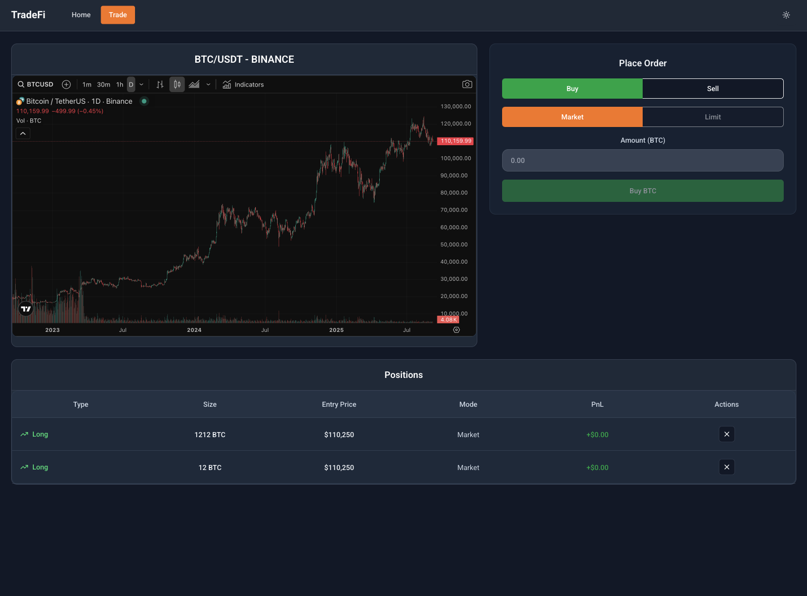

# TradeFi Demo

A modern cryptocurrency trading application built with React, TypeScript, and Vite. Features real-time market data, interactive trading interface, and responsive design with dark/light theme support.

## Features

- Real-time cryptocurrency market data via WebSocket connections
- Interactive trading interface with live price updates
- Responsive design optimized for desktop and mobile
- Dark/light theme toggle
- Market position tracking
- Modern UI with Tailwind CSS and Radix UI components
- Comprehensive test coverage with Jest

## Screenshots

### Desktop Views

| Light Theme                                         | Dark Theme                                        |
| --------------------------------------------------- | ------------------------------------------------- |
|    |    |
|  |  |

### Mobile Views

| Light Theme                                               | Dark Theme                                              |
| --------------------------------------------------------- | ------------------------------------------------------- |
|    |    |
|  |  |

## Setup Instructions

### Prerequisites

- Node.js (version 18 or higher)
- npm or yarn package manager

### Installation

1. Clone the repository:

```bash
git clone <repository-url> tradefi
cd tradefi
```

2. Install dependencies:

```bash
npm install
```

3. Start the development server:

```bash
npm run dev
```

4. Open your browser and navigate to `http://localhost:4173`

### Available Scripts

- `npm run dev` - Start development server with hot reload
- `npm run build` - Build for production
- `npm run preview` - Preview production build locally
- `npm run lint` - Run ESLint for code quality checks
- `npm run test` - Run test suite
- `npm run test:watch` - Run tests in watch mode
- `npm run test:coverage` - Generate test coverage report

## Architecture Overview

The application follows a modern React architecture with clear separation of concerns:

### Project Structure

```
src/
├── components/          # Reusable UI components
│   ├── common/         # Shared components (loaders, error boundaries)
│   ├── home/           # Home page specific components
│   ├── trade/          # Trading interface components
│   └── ui/             # Base UI components (buttons, inputs, etc.)
├── constants/          # Application constants and configuration
├── contexts/           # React contexts (Theme, WebSocket)
├── hooks/              # Custom React hooks
│   └── queries/        # React Query hooks for data fetching
├── layout/             # Layout components
├── pages/              # Page components (Home, Trade, NotFound)
├── services/           # External service integrations
│   ├── HyperliquidApiService/  # Trading API integration
│   ├── LocalStorageService/   # Browser storage management
│   └── WebSocketService/      # Real-time data connections
├── stores/             # Zustand state management
│   ├── MarketsStore/   # Market data state
│   ├── NavigationStore/ # Navigation state
│   └── PositionsStore/ # Trading positions state
├── types/              # TypeScript type definitions
└── utils/              # Utility functions and helpers
```

### Key Technologies

- **React 19** - UI framework with latest features
- **TypeScript** - Type safety and developer experience
- **Vite** - Fast build tool and development server
- **Tailwind CSS** - Utility-first CSS framework
- **Zustand** - Lightweight state management
- **React Query** - Server state management and caching
- **React Router** - Client-side routing
- **Radix UI** - Accessible component primitives
- **Jest** - Testing framework

### State Management

- **Zustand stores** for client-side state (markets, navigation, positions)
- **React Query** for server state management and caching
- **React Context** for theme and WebSocket connections

### Data Flow

1. **WebSocket Service** establishes real-time connections to market data
2. **Hyperliquid API Service** handles trading operations and market queries
3. **Zustand stores** manage application state with Immer for immutable updates
4. **React Query** caches and synchronizes server data
5. **Components** consume state via custom hooks and context providers

### Testing Strategy

- Unit tests for utilities and pure functions
- Component tests with React Testing Library
- Integration tests for complex user flows
- Mocking strategies for external services and WebSocket connections
